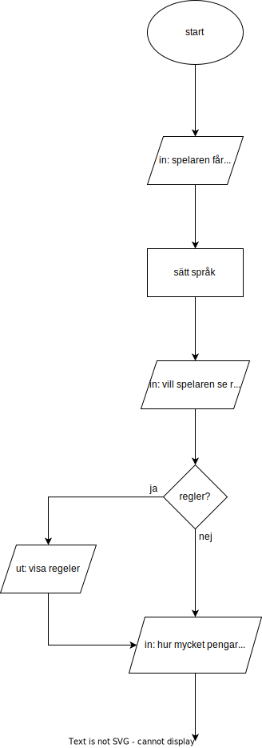

# Inlämningsuppgift 2
# Enarmad bandit

 

Grundläggande programmering med C++  
(Erik Gustafsson, Datavetenskap inriktning systemutveckling, a23erigu)

 
 
 
 
 
 

## Introduktion

Uppgiften går ut på att skapa spelet enarmad bandit.  
Enarmad bandit går ut på att stopa snurrande cylindrar så symbolerna på cylindrarna hamnar i rader.  
Raderna kan vara horisontella, vertikala eller diagonala.  
Denna version av enarmad bandit använder inte cylindrar utan istället slumpar mellan tre olika symboler i nio rutor som liger i ett tre gånger tre nät.  
Om dom symbolerna formar en rad så får spelaren en två gånger sin insats.  
Finns det tre rader får spelaren tre gånger insatsen.  
Formas det fem rader får spelaren fem gånger insatsen.  
Är alla rutor samma symbol får spelaren tio gånger insatsen.  
Spelaren ska endast få satsa med 100, 300 eller 500 kr. 

 

## Problembeskrivning

Några delproblem som har identifierats till detta program är: 

### Spelaren ska kunna välja språk i början av programmet 
Spelaren får välja mellan svenska och engelska genom att skriva en 1 eller 2.

### Programmet borde kunna visa regler på hur det funkar för spelare som inte spelat enarmad bandit förut 
Spelaren får en fråga om att visa regler och spelaren får svara med 1 eller 2. 

### Hur mycket pengar spelaren ska börja med.  
Spelaren får välja skälv hur mycket den vill seta in i spelet men det måste vara minst 100 kr då det är det minimala en spelare få gissa på i spelet.

### Kunna vissa hur mycket pengar spelaren har.   
Programmet ska kunna vissa hur mycket pengar spelaren har just nu och hur mycket deras pengar har ändrat sig ifrån det som dom satte in.

### Hur spelaren ska kunna gissa 
Spelaren ska få valet att gissa på 100, 300 eller 500 kr under varje omgång genom att skriva 1, 2 eller 3 om dom har pengar frö sin gissning.

### Skapa ett tre gånger tre bräde
Skapandet av brädet görs genom att i början av koden skapa en lista som innehåller tre andra listor som alla har tre tomma värden i sig.

### Kunna slumpa nio stycken symboler till brädet. 
slumpandet av brädet sker i en loop som går igenom alla plates och ger ut en av tre olika symboler till varje.

### Vissa brädet på ett snyggt sät till spelaren.  
Programmet skriver ut varje plats i brädet för sig med ett litet mellanrum mellan symbolerna.

### Hur programmet ska kunna hitta rader i brädet.  
Programmet går igenom alla olika sät rader kan formas i brädet och kolar var och en för att se om det fins en rad där.

### Räkna ut hur många rader det fins.  
Programmet börjar på max antal rader det kan finnas i brädet och för varje gång den inte hittar en rad i brädet så minskar den antalet rader med en tills programmet har gåt igenom alla olika rader.

### Hur mycket pengar spelaren van eller förlora.  
Om det fans några rader alls så van spelaren annars så förlorar spelaren sin satsning.  
Beroende på hur många rader som fins i brädet så ökar spelaren satsning olika mycket så desto mer rader i brädet desto mer vinner spelaren.

### Hur spelaren ska kunna köra igen.
Spelaren får ett val om dom vill fortsätta spela och frå svara med 1 eller 2.  
Svarar spelaren ja kommer dom tillbaka till satsning annars slutar spelet och dom får veta hur mycket deras pengar ändrats från vad dom satte in.

 

## Antaganden och krav

Några krav som identifierats för denna enarmade bandit är:  

### Välja språk mellan svenska och engelska
Språkval är viktigt då det finns många som inte kan svenska och dom borde också kunna köra roulettehjulet.

### Kunna visa regler om spelaren önskar det
Många har inte spelat roulette och olika rouletter har olika regler så borde kunna visa upp reglerna på roulettehjulet.

### Välja Start kapital 
Spelaren ska få välja hur mycket pengar dom säter in på spelet.

### Bara kunna satsa på 100, 300 eller 500kr
Spelaren ska bara kunna välja mellan 100, 300 eller 500 kr om dom har tillräckligt med pengar.

### Bestämma när spelet startar
Spelaren ska få bestämma när spelet ska starta.

### Nio olika rutor
Spelet ska bestå av nio ruter i ett tre gånger tre rutnät.

### Tre stycken olika symboler
Spelet ska ha tre olika symboler som ska kunna hamna i dom nio rutorna.

### Slumpmässigt rullning
Symbolerna i rutnätet ska alla vara slumpmässigt framtagna.

### Ändra spelarens pengar beroende på om den vann eller förlorade
Om spelet rulla en rad ska spelaren få två gånger satsning.  
Om spelet rulla tre rader ska spelaren få tre gånger satsning.  
Om spelet rulla fem rader ska spelaren få fem gånger satsning.  
Om spelet rulla alla rutor samma ska spelaren få tio gånger satsning.  
Om spelet inte rulla någon rad ska spelaren förlora det dom satsade.

### Sparka ut spelaren om den har slut på pengar
Spelaren ska inte få spela om den har slut på pengar.

### Kunna fortsätta spela rouletten  
Spelaren ska få fortsätta spela så länge som den har pengar.

 

## Lösningsdesign 

### Start av programmet 

Så som det var tänkt med denna uppgift är det skulle var bäst att 
försöka göra språk delen först då det nog kommer behöva  
skriva ut saker i terminalen till alla andra delar  
så att fixa språket först kändes viktigast.

För att göra språket skulle det nog vara bäst att sätta språk delen i en funktion så om någon del av språk skulle behövas uppdatera under spelets gång kan programmet bara köra funktionen.

Efter språk ska spelaren få valet om regler då spelaren nog vill kunna ha reglerna innan spelet startar. 

Delen efter regler ska vara hur mycket pengar spelaren vill sätta in på spelet då det behöver att man har sat in några pengar innan det går att köra spelet.

 

  
bild på språk, regler och insättning designen

 

### Satsning och slumping

När spelaren har valt in insättning så ska spel loopen börja. 
I spel loopen ska det börja med att vissa mängden pengar spelaren har och fråga hur mycket pengar spelaren vill satsa dena rundan.

Spelaren har också valet om dom vill börja om satsningen om dom satsat fel.

Om satsningen är klar ska programmet börja med att rulla fram brädet.  
Rullningen av brädet var tänkt att vara en funktion som slumpmässigt ger alla position på brädet en av tre olika strängar.

Efter att brädet har rullats fram ska det vissas för spelaren.

 

  
bild på satsning och slumpanden av brädet designen

 

### Antalet rader och vinst

När programmet har visat det framrullade brädet för spelaren ska den sedan börja undersöka hur många rader det fins på brädet.  
Detta var tänka att hända i en funktion som går igenom alla typer av rader det kan ha blivit.

Efter att ha hitat hur många rader som det fins på brädet ska programmet ge utt korrekt vinst till spelaren (om spelaren van).  
Detta skulle häls göras i en funktion som tar in hur mycket spelaren satsade och hur mycket det ska ändras med.

 

  
bild på hitta rader och vinst designen

 

### Slutet av programmet

Efter att ha räknat ut vinsten/förlusten ska programmet kolla om spelaren ha pengar kvar att spel för.

Har spelaren pengar kvar ska spelaren få valet om den vill fortsätta spel vilket tar den tillbaka till början av spel loopen om den säjer ja.

 

  
bild på slutet i flödesdiagrammet

 

### Hela flödesdiagrammet

 

  
bild på hela flödesdiagrammet

 

## Problem

Problem som stöttes på under programmerandet var

* att skicka med en matris i en funktion.  
Detta problem var att spel brädet skulle skickas in i en funktion för att läsa mängden raden den hade men matrisen som skickades till funktion ville inte helt fungera som vanligt då kommandon som size() inte fungerade längre.  
Det jag kom till at märka var att när matrisen skickades till funktion var det inte matrisen skälv som skickades utan en pekare till matrisen vilket gjorde att kommandon som size() inte fungerade längre då dom bara fungera på matrisen skälv.  
Problemet löstes genom att göra size() utanför funktionen och sedan skick med storleken som en separat variabel i funktionen.

* att skicka strängar i en int cin.  
Problemet vara att om man skrev stränga i en cin som bara tog int hamnade programmet i en oändlig loop så man behövde starta om.  
Problemet löstes genom funktionen

        void cin_check(){
            if (cin.fail()){
                cin.clear();
                cin.ignore(256, '\n');
            }
        }

    Det funktionen gör är att börja med att kolla om cin har misslyckats (fåt en string när den bara kan ta int) genom cin.fail().  
    Om cin är misslyckad så tar programmet och stoppar cin från att fortsätta använda det som har skickats in genom cin.clear().  
    Efter att ha stoppat cin från att fortsätta använda det som skickat in används cin.ignore(256, '\n') för att säja till cin att ignorera det strängar som redan är i cin.  
    Ett problem med lösningen är att om man skulle skriva exempel 100hejdettaärtest skulle programmet ta det som 100 och sedan skicka in resten av inputen i nästa cin som kommer då få ett fel medelande. Det händer dock bara om man skriver in siffror i början av inputen annars kommer programmet slänga bort hela inputen.

 

## Beskrivning av kod

### Start av programmet

Början av koden är vart jag skapar språk som globala variabler.  
Detta görs då språk används av flera funktioner så språk variablerna fick bli globala.  

Efter dom globala variablerna skapas fler funktioner som kommer tas upp om när dom används.

I början av main är vart konsol språket sätts och slump generatorn startars.  
Den är sedan följd av några lokala variabler för programmet.

 

### Språk

Delen efter skapandet av variablerna är språk.  
Språk börjar med att fråga vad spelaren vill ha för språk vilket sedan blir skickat till en språk funktion som sedna sätter språket.  
Språk funktion tar emot många variabler men den viktigaste (language) är vilket språk spelaren vill ha.

    void language_set(int language, int total_money){
        if (language == 1){
            invalid_selection = "Not a valid argument, please try again";
            welcome = "Hello and welcome to this slot machine";
            question_rules = "Do you want to see the rules? (1 for yes, 2 for no)";
            total_money_text = "Your total amount of money to play with is " + to_string(total_money) + " kr";
        }
        else if (language == 2){
            invalid_selection = "Inte ett giltigt argument, snälla försök igen";
            welcome = "Hej och välkommen till denna enarmade bandit";
            question_rules = "Vill du see reglerna? (1 för ja, 2 för nej)";
            total_money_text = "Din totala summa pengar att spela med är " + to_string(total_money) + " kr";
        }
    }
En del av språk för exempel

 

### Regler och insättning

Följt av språk är Regel biten.
Regler är en cin som frågar om spelaren vill se regalerna och visar dom om spelaren vill see

Efter regler är insättning vilket är en cin som tar alla tal över 100 som spelarens start summa.

När programmet är klar med insättning så starta spel loopen.

 

### Satsning 

Första biten i spel loopen är satsning.   
Satsning fungerar genom att ta 1, 2 eller 3 (100, 300 och 500 respektive) för att bestämma hur mycket spelaren vill satsa.  
Fins också en check för om spelaren har pengar för sin satsning.

Satsning delen slutar med en fråga om spelaren är säker på om dom vill börja med den satsningen som dom valt och svar dom nej här går dom tillbaka till början av satsning.

    cout<< blank << endl;
    cout<< total_money_text << endl;
    cout<< total_money_change_text << endl;
    _sleep(3000);

    cout<< blank << endl;
    cout<< question_bet << endl;

    cin >> bet_choice;
    cin_check();

    if (bet_choice == 1){
        bet_amount = 100;
    }
    else if (bet_choice == 2){
        bet_amount = 300;
    }
    else if (bet_choice == 3){
        bet_amount = 500;
    }
Exempel på satsning

 

### Rullandet av brädet

När spelaren är säker på sin  satsning så börjar programmet med att rulla brädet.  
Detta sker i en for loop som går igenom alla platser i brädet och kör en funktion på dom som ger en slumpmässig symbol.

Slutet av rullningen är också där programmet visar brädet för spelaren.

    for (int i = 0; i < size_board; i++){
        for (int x = 0; x < size(board[i]); x++){
            symbol = Role_symbols();
            board[i][x] = symbol;
        } 
    }
For loopen för rullandet av brädet

 

    string Role_symbols(){
        int role;
        string answer;
        role = rand() % 3 + 1;

        if (role == 1){
            answer = "A";
        }
        else if (role == 2){
            answer = "B";
        }
        else if (role == 3){
            answer = "C";
        }

        return answer;
    }
Funktionen för slumpande av symboler

 

### Hitta rader

För att programmet ska kunna hitta mängden rader i brädet används funktionen Check_board som tar emot brädet och storleken av brädet och ger sedan tillbaka mängden rader i brädet.

Check_board går igenom alla möjliga sät rader kan formas på för att see hur många rader det fins.
För att göra detta använder Check_board funktionerna horizontal och vertical vilket går igenom vertikala och horisontella rader.
Check_board har också två for loopar för att kolla diagonala rader.  
Check_board räknar baklänges så börjar på det högsta mängden rader (8) och för varje gång den inte hittar en rad minskar den talet med 1.

    int Check_board(string board[3][3], int true_size_board){
        int rows = 8;
        const int size_board = true_size_board - 1;
        int outer_board = true_size_board - 1;
        int inner_board = 0;
        
        rows -= horizontal(board, 0, size_board);
        rows -= horizontal(board, 1, size_board);
        rows -= horizontal(board, 2, size_board);

        rows -= vertical(board, 0, size_board);
        rows -= vertical(board, 1, size_board);
        rows -= vertical(board, 2, size_board);

        /*--------------------------*\
        |   Kollar diagonala rader   |
        \*--------------------------*/
        for (int i = 0; i < size_board; i++){
            if (board[i][i] != board[i+1][i+1]){
                rows -= 1;
                break;
            }
        }

        for (int i = 0; i < size_board; i++){
            if (board[outer_board][inner_board] != board[outer_board-1][inner_board+1]){
                rows -= 1;
                break;
            }
            outer_board -= 1;
            inner_board += 1;
        }

        return rows;
    }
Hur Check_board ser ut

 

    int horizontal(string board[3][3], int row, int size_board){
        int answer = 0;

        for (int i = 0; i < size_board; i++){
            if (board[row][i] != board[row][i+1]){
                answer = 1;
                break;
            }
        }

        return answer;
    }
Hur funktionen horizontal ser ut

 

    int vertical(string board[3][3], int colum, int size_board){
        int answer = 0;

        for (int i = 0; i < size_board; i++){
            if (board[i][colum] != board[i+1][colum]){
                answer = 1;
                break;
            }
        }

        return answer;
    }
Hur funktionen vertical ser ut

 

### Vinst check

När programmet har hitat antalet rader så ska det räkna ut hur mycket spelaren har vunnit eller förlorat.  
Detta görs genom en if sats som går igenom hur mycket en spelare ska få beroende på hur många rader som rullades.
När programmet vet hur mycket den ska öka med skickas det med i en funktion som heter win_amount.  
win_amount tar emot hur mycket spelaren satsade och med hur mycket den ska öka och ger då tillbaka hur mycket programmet ska ändra spelarens pengar med.

    if (rows == 0){
        money_change = win_amount(bet_amount, -1);
        win_check = 0;
    }
    else if (rows > 0 && rows < 3){
        money_change = win_amount(bet_amount, 2);
        win_check = 1;
    }
    else if (rows >= 3 && rows < 5){
        money_change = win_amount(bet_amount, 3);
        win_check = 1;
    }
    else if (rows >= 5 && rows < 8){
        money_change = win_amount(bet_amount, 5);
        win_check = 1;
    }
    else if (rows == 8){
        money_change = win_amount(bet_amount, 10);
        win_check = 1;
    }
Hur if satsen för vinst ser ut

 

    int win_amount(int bet_amount, int modifier){
        int answer;
        answer = bet_amount * modifier;
        return answer;
    }
Hur win_amount ser ut

 

### Slutet

Det sista som är i programmet är en check om spelaren fortfarande har pengar och frågan om spelaren vill fortsätta.
Vill spelaren fortsätta så kommer dom tillbaka till satsning biten.
Om spelaren väljer att sluta så får dom ut hur mycket pengar dom har nu och hur mycket det ändra sig ifrån det dom satte in.

 

## Diskussion

Några svagheter med mit program är att alla mina strängar för text är satta som globala variabler. Det gör att strängarna är en säkerhets riks för minnes hantering men vet inte helt hur jag skulle kunna gör om strängarna till lokala variabler då flera funktioner behöver dom.
En annan svaghet med mit program är hur jag har gjort min matris då från vad jag har kunnat hit så fins det nyare sät att göra matriser på genom std::array vilket skulle göra säkrare matriser då man inte kan råka gå utanför dom typerna av matriser.
Sättet som brädet är visat för spelaren fungerar men är ganska dåligt och borde kunna göras mycket bättre.

En styrkor med mit program är hur programmet rullar fram brädet då det skulle kunna fungera för hur storlek av matris man än har men även att det är en ganska liten kod så den tar inte upp mycket minne. En annan styrka med mit program är hur programmet hittar rader i brädet då hela den biten är i en funktion som ganska effektivt hittar antalet rader i brädet.

## Källkod

    #include <iostream> 
    #include <string>       //används för att kunna konvertera int till string
    #include <ctime>        //används för att kunna slumpa fram ett tal
    #include <Windows.h>    //används för att kunna sätta output konsollen till UTF-8
    using namespace std;

    /*------------------------------*\
    |   Globala strängar för språk   |
    \*------------------------------*/ 
    string blank = " ";
    string welcome;
    string invalid_selection;
    string question_rules; 
    string rules_1;
    string rules_2;
    string rules_3;
    string rules_4;
    string rules_5;
    string rules_6;
    string question_deposit;
    string total_money_text;
    string total_money_change_text;
    string question_bet;
    string not_enough_money;
    string question_start_loop;
    string amount_of_rows;
    string lose;
    string win;
    string out_of_money;
    string play_again;
    string total_money_end;
    string total_money_change_end;

    /*----------------------------------*\
    |   Funktion för att sätta språket   |
    \*----------------------------------*/
    void language_set(int language, int total_money, int total_money_change, int bet_amount, int rows, int money_change){

        if (language == 1){
            invalid_selection = "Not a valid argument, please try again";
            welcome = "Hello and welcome to this slot machine";
            question_rules = "Do you want to see the rules? (1 for yes, 2 for no)";
            rules_1 = "The slot machine works like this";
            rules_2 = "The player start by deciding how much money they want to deposit.";
            rules_3 = "Then the player gets to deciding how much to bet on a round. (100, 300 or 500 kr)";
            rules_4 = "The machine will then roll a random pattern with three symbols on a three by three grid.";
            rules_5 = "If there is at least one row of three symbols either horizontally, vertically or diagonally then the player wins.";
            rules_6 = "One row = two times bet, Three rows = three times bet, Five rows = five times bet, Full board = ten times bet. (anything in between defaults down)";
            question_deposit = "Please put in how much you wish to deposit in to the game (minimum of 100 kr)";
            total_money_text = "Your total amount of money to play with is " + to_string(total_money) + " kr";
            total_money_change_text = "Your total change in money is " + to_string(total_money_change) + " kr";
            question_bet = "How much do you want to bet this round? (1 for 100, 2 for 300, 3 for 500)";
            not_enough_money = "Not enough money for that bet";
            question_start_loop  = "Are you sure you want to start the game with a bet of " + to_string(bet_amount) + " kr? (1 for yes, 2 for no)";
            amount_of_rows = "From the board that was rolled there are " + to_string(rows) + " rows of symbols";
            lose = "You have lost the game and your bet";
            win = "You have won the game and your money has increased with " + to_string(money_change) + " kr";
            out_of_money = "You have run out of money and have therefore been kicked out of the game";
            play_again = "Du you want to play again? (1 for yes, 2 for no)";
            total_money_end = "The slot machine has given you " + to_string(total_money) + " kr";
            total_money_change_end = "Your change in money from what you began with is " + to_string(total_money_change) + " kr";
        }
        else if (language == 2){
            invalid_selection = "Inte ett giltigt argument, snälla försök igen";
            welcome = "Hej och välkommen till denna enarmade bandit";
            question_rules = "Vill du see reglerna? (1 för ja, 2 för nej)";
            rules_1 = "Dena enarmade bandit fungerar så här";
            rules_2 = "Spelaren börjar med att bestämma hur mycket pengar de vill sätta in.";
            rules_3 = "Sedan får spelaren bestämma hur mycket den ska satsa på en runda. (100, 300 eller 500 kr)";
            rules_4 = "Maskinen kommer sedan att rulla ett slumpmässigt mönster med tre symboler på ett tre gånger tre rutnät.";
            rules_5 = "Om det finns minst en rad med tre symboler antingen horisontellt, vertikalt eller diagonalt så vinner spelaren.";
            rules_6 = "En rad = två gånger insats, Tre rader = tre gånger insats, Fem rader = fem gånger insats, Fullt bord = tio gånger insats. (allt emellan sänks till standard)";
            question_deposit = "Vänligen fyll i hur mycket du vill sätta in på spelet (minst 100 kr)";
            total_money_text = "Din totala summa pengar att spela med är " + to_string(total_money) + " kr";
            total_money_change_text = "Din totala förändring i pengar är " + to_string(total_money_change) + " kr";
            question_bet = "Hur mycket vill du satsa den här omgången? (1 för 100, 2 för 300, 3 för 500)";
            not_enough_money = "Inte tillräckligt med pengar för den satsningen";
            question_start_loop  = "Är du säker på att du vill starta spelet med en satsning på " + to_string(bet_amount) + " kr? (1 för ja, 2 för nej)";
            amount_of_rows = "Från brädet som rullades finns det " + to_string(rows) + " rader av symboler";
            lose = "Du har förlorat spelet och din insats";
            win = "Du har vunnit spelet och dina pengar har ökat med " + to_string(money_change) + " kr";
            out_of_money = "Du har slut på pengar och har därför blivit utslängd ur spelet";
            play_again = "Vill du spela igen? (1 för ja, 2 för nej)";
            total_money_end = "Spelautomaten har gett dig " + to_string(total_money) + " kr";
            total_money_change_end = "Din förändring i pengar från vad du började med är " + to_string(total_money_change) + " kr";
        }

    }

    /*-------------------------------------------*\
    |   Funktion för att slumpa fram symbolerna   |
    \*-------------------------------------------*/
    string Role_symbols(){
        int role;
        string answer;
        role = rand() % 3 + 1;

        if (role == 1){
            answer = "A";
        }
        else if (role == 2){
            answer = "B";
        }
        else if (role == 3){
            answer = "C";
        }

        return answer;
    }

    /*----------------------------------------------*\
    |   Funktion för att kollar horisontella rader   |
    \*----------------------------------------------*/
    int horizontal(string board[3][3], int row, int size_board){
        int answer = 0;

        for (int i = 0; i < size_board; i++){
            if (board[row][i] != board[row][i+1]){
                answer = 1;
                break;
            }
        }

        return answer;
    }

    /*-------------------------------------------*\
    |   Funktion för att kollar vertikala rader   |
    \*-------------------------------------------*/
    int vertical(string board[3][3], int colum, int size_board){
        int answer = 0;

        for (int i = 0; i < size_board; i++){
            if (board[i][colum] != board[i+1][colum]){
                answer = 1;
                break;
            }
        }

        return answer;
    }

    /*----------------------------------------------------*\
    |   Funktion för att kollar hur många rader som fins   |
    \*----------------------------------------------------*/
    int Check_board(string board[3][3], int true_size_board){
        int rows = 8;
        const int size_board = true_size_board - 1;
        int outer_board = true_size_board - 1;
        int inner_board = 0;
        
        rows -= horizontal(board, 0, size_board);
        rows -= horizontal(board, 1, size_board);
        rows -= horizontal(board, 2, size_board);

        rows -= vertical(board, 0, size_board);
        rows -= vertical(board, 1, size_board);
        rows -= vertical(board, 2, size_board);

        /*--------------------------*\
        |   Kollar diagonala rader   |
        \*--------------------------*/
        for (int i = 0; i < size_board; i++){
            if (board[i][i] != board[i+1][i+1]){
                rows -= 1;
                break;
            }
        }

        for (int i = 0; i < size_board; i++){
            if (board[outer_board][inner_board] != board[outer_board-1][inner_board+1]){
                rows -= 1;
                break;
            }
            outer_board -= 1;
            inner_board += 1;
        }

        return rows;
    }

    /*-------------------------------------*\
    |   Funktion för att räkna ut vinsten   |
    \*-------------------------------------*/
    int win_amount(int bet_amount, int modifier){
        int answer;
        answer = bet_amount * modifier;
        return answer;
    }

    /*----------------------------------------------------------*\
    |   Funktion för att checka och fixa cin om något går fell   |
    \*----------------------------------------------------------*/
    void cin_check(){
        if (cin.fail()){
            cin.clear();
            cin.ignore(256, '\n');
        }
    }

    /*--------------------*\
    |   Här startar main   |
    \*--------------------*/
    int main()
    {
        SetConsoleOutputCP(CP_UTF8);      // sätter konsolen till UTF-8
        srand(time(0));

        // variabler för val i programmet
        int language;
        int rules_choice;
        int deposit_choice;
        int bet_choice;
        int start_loop_choice;
        
        // variabler för pengar och vinst
        int total_money = 0;
        int total_money_change = 0;
        int money_change = 0;
        int bet_amount = 0;
        int win_check = 0;
        int keep_playing = 0;

        // variabler för brädet
        string board[3][3];
        int size_board = size(board); 
        string symbol;
        int rows = 0;

        /*---------------------------------------------*\
        |   Tar reda på vilket språk spelaren vill ha   |
        \*---------------------------------------------*/
        while(true)
        {
            cout<< blank << endl;
            cout<< "Please chose a language | Snälla välj ett språk" << endl;
            cout<< "1 for english, 2 för svenska" << endl;

            cin>> language; 
            cin_check();

            if (language == 1 || language == 2){
                break;
            } 
            else{
                cout<< "Please try again | Snälla försök igen" << endl;
                _sleep(1000);
            }
        }
        
        language_set(language, total_money, total_money_change, bet_amount, rows, money_change);

        cout<< welcome << endl;

        /*---------------------------------*\
        |   Ger valet om att vissa regler   |
        \*---------------------------------*/
        while (true){
            cout<< blank << endl;
            cout<< question_rules << endl;

            cin >> rules_choice;
            cin_check();

            if (rules_choice == 1){
                cout<< blank << endl;
                cout<< rules_1 << endl;
                cout<< rules_2 << endl;
                cout<< rules_3 << endl;
                cout<< rules_4 << endl;
                cout<< rules_5 << endl;
                cout<< rules_6 << endl;

                _sleep(5000);
                break;
            }
            else if(rules_choice == 2){
                break;
            }
            else{
                cout<< invalid_selection << endl;
                _sleep(1000);
            }
        }

        /*------------------------------------------------------*\
        |   Frågar om hur mycket pengar spelaren vill sätta in   |
        \*------------------------------------------------------*/
        while (true){
            cout<< blank << endl;
            cout<< question_deposit << endl;

            cin >> deposit_choice;
            cin_check();

            if (deposit_choice < 100){
                cout<< invalid_selection << endl;
                _sleep(1000);
            }
            else{
                total_money = deposit_choice;
                break;
            }
        }

        /*--------------------------*\
        |   Starten av spel loopen   |
        \*--------------------------*/
        while(true)
        {
            language_set(language, total_money, total_money_change, bet_amount, rows, money_change);

            /*-------------------*\
            |   Satsnings delen   |
            \*-------------------*/
            while(true)
            {   
                /*----------------------------------*\
                |   Hur mycket spelaren vill satsa   |
                \*----------------------------------*/
                cout<< blank << endl;
                cout<< total_money_text << endl;
                cout<< total_money_change_text << endl;
                _sleep(3000);

                cout<< blank << endl;
                cout<< question_bet << endl;

                cin >> bet_choice;
                cin_check();

                if (bet_choice == 1){
                    bet_amount = 100;
                }
                else if (bet_choice == 2){
                    bet_amount = 300;
                }
                else if (bet_choice == 3){
                    bet_amount = 500;
                }
                else{
                    cout<< invalid_selection << endl;
                    _sleep(1000);
                    continue;
                }

                /*-----------------------------------------------*\
                |   Om spelaren har tillräckligt för satsningen   |
                \*-----------------------------------------------*/
                if (bet_amount > total_money){
                    cout<< not_enough_money << endl;
                    _sleep(1000);
                    continue;
                }

                /*----------------------------------*\
                |   Om spelaren vill starta spelet   |
                \*----------------------------------*/
                while (true)
                {
                    language_set(language, total_money, total_money_change, bet_amount, rows, money_change);
                    cout<< blank << endl;
                    cout<< question_start_loop << endl;

                    cin >> start_loop_choice;
                    cin_check();

                    if (start_loop_choice == 1 || start_loop_choice == 2){
                        break;
                    }
                    else{
                        cout<< invalid_selection << endl;
                        _sleep(1000);
                        continue;
                    }
                }

                if (start_loop_choice == 1){
                    break;;
                }
                
            }
            
            /*-----------------------*\
            |   Slumpar fram brädet   |
            \*-----------------------*/
            for (int i = 0; i < size_board; i++){
                for (int x = 0; x < size(board[i]); x++){
                    symbol = Role_symbols();
                    board[i][x] = symbol;
                } 
            }

            /*----------------*\
            |   Visar brädet   |
            \*----------------*/
            cout<< blank << endl;
            cout<< board[0][0] + " " + board[0][1] + " " + board[0][2] << endl;
            cout<< board[1][0] + " " + board[1][1] + " " + board[1][2] << endl;
            cout<< board[2][0] + " " + board[2][1] + " " + board[2][2] << endl;
            _sleep(3000);

            /*---------------------------------*\
            |   Hittar mängden rader i brädet   |
            \*---------------------------------*/
            rows = Check_board(board, size_board);

            language_set(language, total_money, total_money_change, bet_amount, rows, money_change);

            cout<< blank << endl;
            cout<< amount_of_rows << endl;
            _sleep(3000);

            /*------------------------------------------------*\
            |   Har spelaren vunnit och i så fall hur mycket   |
            \*------------------------------------------------*/
            cout<< blank << endl;
            if (rows == 0){
                money_change = win_amount(bet_amount, -1);
                win_check = 0;
            }
            else if (rows > 0 && rows < 3){
                money_change = win_amount(bet_amount, 2);
                win_check = 1;
            }
            else if (rows >= 3 && rows < 5){
                money_change = win_amount(bet_amount, 3);
                win_check = 1;
            }
            else if (rows >= 5 && rows < 8){
                money_change = win_amount(bet_amount, 5);
                win_check = 1;
            }
            else if (rows == 8){
                money_change = win_amount(bet_amount, 10);
                win_check = 1;
            }

            total_money += money_change;
            total_money_change += money_change;
            language_set(language, total_money, total_money_change, bet_amount, rows, money_change);

            if (win_check == 1){
                cout<< win << endl;
            }
            else if (win_check == 0){
                cout<< lose << endl;
            }

            /*--------------------------------------------------------*\
            |   Om spelaren har pengar nog att kunna fortsätta spela   |
            \*--------------------------------------------------------*/
            if (total_money < 100){
                cout<< blank << endl;
                cout<< out_of_money << endl;
                break;
            }

            cout<< blank << endl;
            cout<< total_money_text << endl;
            cout<< total_money_change_text << endl;
            _sleep(3000);

            /*------------------------------------*\
            |   Om spelaren vill fortsätta spela   |
            \*------------------------------------*/
            while (true)
            {
                cout<< blank << endl;
                cout<< play_again << endl;

                cin>> keep_playing;
                cin_check();

                if (keep_playing == 1 || keep_playing == 2){
                    break;
                }
                else{
                    cout<< invalid_selection << endl;
                    _sleep(1000);
                }
            }
            
            if (keep_playing == 1){
                continue;      
            }
            else{
                cout<< blank << endl;
                cout<< total_money_end << endl;
                cout<< total_money_change_end << endl;
                cout<< blank << endl;
                break;
            }

        }

        return 0;
    }
