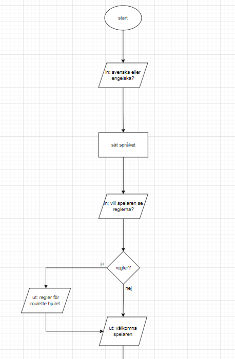
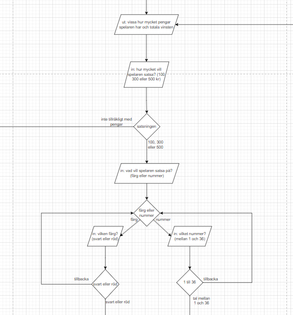
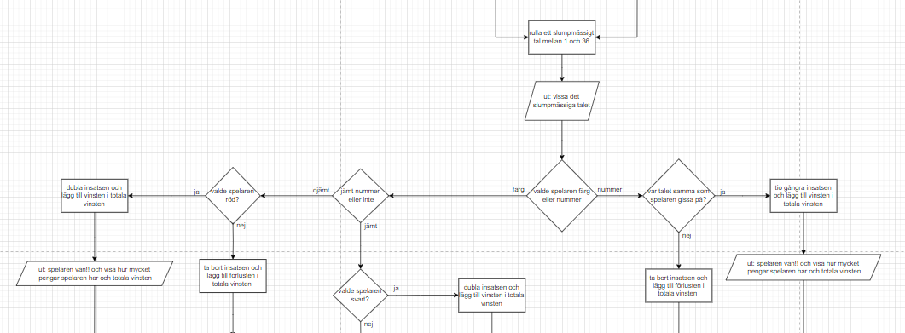
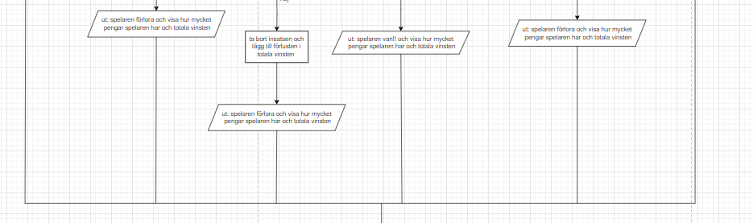
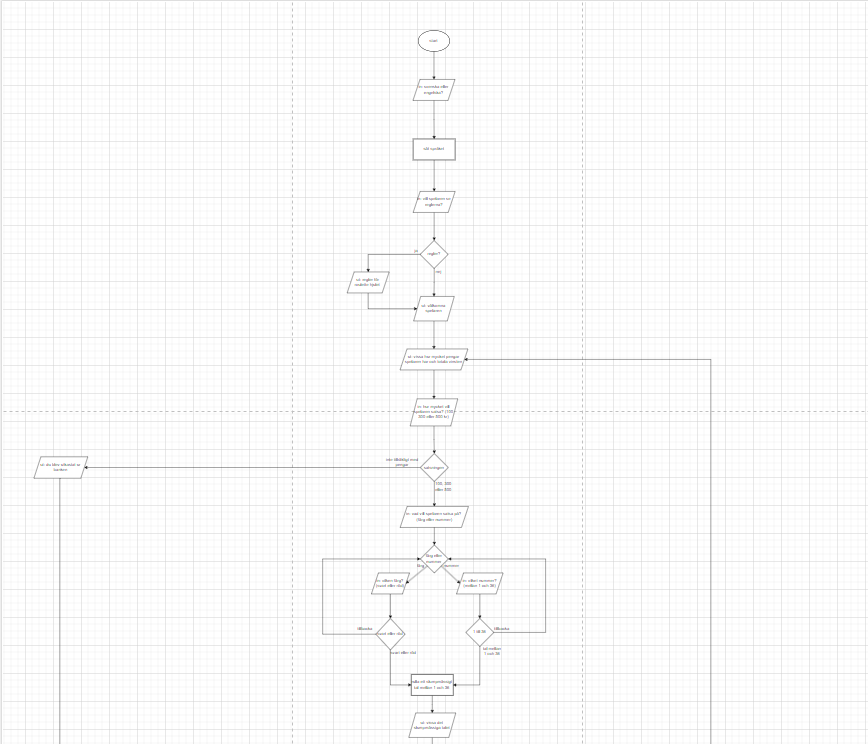
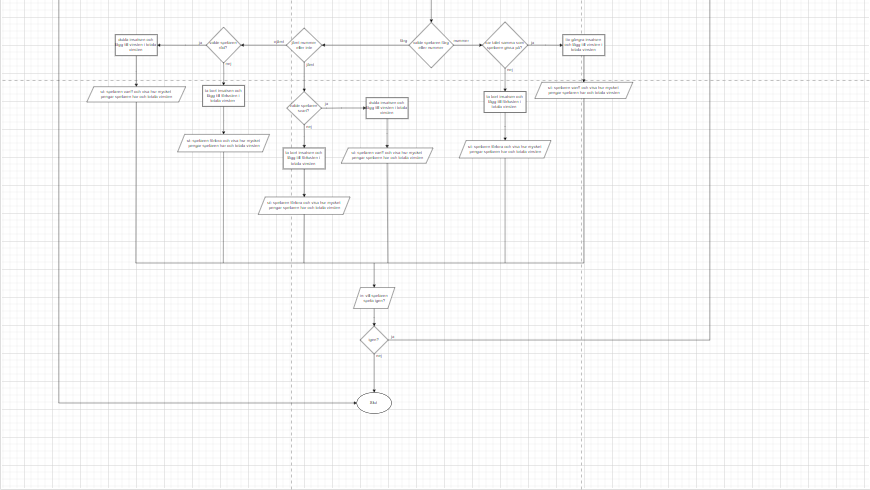

# Inlämningsuppgift 1
## Roulette

 

Grundläggande programmering med C++  
(Erik Gustafsson, Datavetesnkap inriktning systemutväkling, a23erigu)

 
 
 
 
 
 

### Introduktion

Denna uppgiften går ut på att skapa ett roulette hjul.  
Deta roulette hjul ska fungera genom att spelaren ska
starta med 1000 kr och sedan kunna satsa antigen  
100, 300 eller 500 kr och sedan kunna gissa på antigen nummer eller färj.  
Roulette hjulet ska ha nummer mellan 1 och 36.  
Ojämna nummer är röda och jämna nummer är svarta.

 

### Problembeskrivning

Några delproblem som jag har identifierat är hur
* man ska kunna välja hur mycket pengar man vill satsa
* programmet ska rula ett slumpmäsigt tal mellan 1 och 36
* programmet ska kunna få reda på vilken färj som det har rulats 
* reglerna ska kunna visas för spelaren
* programmet ska hantera att kunna ha både svenska och engelska som språk

 

### Antaganden och krav

Några krav som jag skälv har märkt för deta roulette hjul är  
att programmet borde kunna visa regler på hur det funkar för   
spelare som inte spelat roulette hjul förut.  
Spelaren borde kunna välja vilket språk som dom vill att spelet   
ska använda.  

 

### Lösningsdesign 

Så som jag tänkte med denna uppgift är att jag skulle vilja   
försöka göra språk delen först då jag nog kommer behöva  
skriva ut saker i terminalen till alla andra delar  
så att fixa språket först känndes viktigast.

För att göra språket känner jag att det skule vara bäst  
om jag i början av programet deklarerade strängar som jag sedan kan tilldela  
beroende på vilket språk folk vill ha.

efter språk biten tänker jag det borde vara bäst att fråga om regler så spelaren kan få reglerna på språket som dom föredrar.

Sedan efter reglerna vill jag att programet ska skriva ut ett välkoms medelande  
efter vilket spel loopen borde börja.  

  
bild på språk och regler design i flödesdiagrammet

I spel loopen borde det börja med att fråga hur mycket pengar man vill satsa  
då jag tycker man ska sattsa pengarna innan valet av vad man sattsar på.
Här tycker jag också man borde ha en check för om spelaren har slut på pengar.

efter att ha tagigt reda på hur mycket pengar spelaren vill sattsa så vill   
jag ta reda på vad dom vill sattsa på

så som jag har tänkt mej med gissningen är att spelaren ska får börja med att   
bestämma om dom vill gissa på färg eller nummer.  
om spelaren valde färg får dom sedan gissa mellan röd och svart eller om dom valde nummer får dom välja vilket nummer dom vill gissar på. 

Jag tycker spelaren ska också ha tillåtelse att gå tillbaka under gissningen om man klikat fel.

  
bild på start av loopen, valet av satsningar och  valet av gissning

Efter att satsningen och gissningsvalen har hänt tycker jag att programmet borde rulla rouletten.

Rulningen borde börjar med att rula ett tal mellan 1 och 36 som sedna skrivs ut  
Efter att ha skrivit ut rullingen borde programmet kolla om spelaren gissade på nummer eller färg.

Om spelaren gissade på nummer så borde bara programmet bara behöver jämföra vad splearen gissa på med vad som rullades och om dom är samma så van spelaren.

Om spelaren gissa på färg så ska programmet kolla om det är ett jämt tal eller inte för att ta reda på färg och sedan kolla om spelaren gissa på korekt färg.

Efter att ha kollat om spelaren van borde programmet skriva ut resultatet och ändra mängden pengar och totala förändringen.

  
bild på rulning och checkning av resultatet

Efter att ha get resultatet så enligt mig borde spelaren få valet om att köra igen.  
Om spelaren väljer att köra igen så kommer dom tillbaka till att få välja sattsning.

  
bild på hela flödesdiagramet

Några svag heter med sättet jag tänk på är att spelaren skule behöva starta om om dom vill kunna byta språk eller undrar något om reglerna.  
Ett annat problem skule vara att spelaren inte kan gå tillbacka om dom vil ändra hur mycket pengar dom vill sattsa.

En styrka med mitt sätt är att man måste välja att satsa på antigen färg eller nummer först vilket betyder att om spelaren vill rösta på nummer så behöver jag bara jämföra nummer och inte bry mej om vilken färg det blev.

 

### Problem

Problem som stötes på under programerandet var

* att få programet att korekt skriva ut svenska då output terminalen inte kunde skriva ut å, ä, eller ö korekt  
Det löstes genom att importera  
<Windows.h>  
vilket innehåller kommandot    
SetConsoleOutputCP(CP_UTF8);  
som satte output terminalen till UTF-8  
så programet kunde korekt skriva ut  å, ä och ö.

* att kombenera strängar med ints då det behövdes för att kunna skriva ut vissa delar som hur mycket man hade att spela för.  
Problemet löstes genom att importera  
<.string>  
som innehöll kommandot   
to_string()   
vilket tillåter convertering av int till string  
så när det skule skriva ut hur mycket spelaren hade användes   
money_amount = "Du har " + to_string(curent_money) + " kr att spela med";

* att kunna stoppa programmet i några sekunder då programet skrev ut mycket information samtidigt så det var svårt att hänga med.   
Deta löstes genom att använda komandot   
_sleep()  
det stoppar programmet i antalet millisekunder som är in skriveret
så genom att skriva in   
_sleep(4000)  
står programmet still i 4 sekunder.
Detta gjorde att det blir enklare för spelaren att hänga med i vad som hände när roulette ljulet kördes.

* att skriva ut dom korekta variablerna i texten då till en början så skev tillexempel  
money_amount = "Du har " + to_string(curent_money) + " kr att spela med";  
att spelaren alltid hade 1000 kr även om curent_money inte var 1000.  
Problemet låg i att tilldela strängar i början av programet så mängden pengar sattes alltid till det som curent_money var i början villket var 1000.  
Det löstes genom att tilldela dom spesifika strängarn senare i spel loopen där variabelna hade ändrats.  
Jag är inte nöjd med denna lösningen då jag skulle föredrat att ha alla språk delar i början av programet men kunde inte hita någon annan lösning.

 

### Beskrivning av kod

Början av koden är där variablera sätts och där så delas dom i strängar som används för text och resten. 

Efter variablera är språk biten villket är en cin med en if satts så spelaren väljer ett språk efter vilket programet använder dom deklarerade variablerna för att säta språket.

en del av språk som exempel

    cin >> language;

        if(language == 1){  // engelska
            invalid_selection = "please try again";
            welcome = "Hello player and welcome to the roulette wheel";
            question_rules = "Do you want to see the rules? (1 for yes 2 for no)";
            rules_1 = "This roulette works in such a way that you can only bet either 
            100, 300, or 500 kr in one round";
            rules_2 = "you then have to choose whether to bet on numbers or colors (even 
            numbers count as black and uneven numbers count as red)"; 
        }
        else if(language == 2){  // svenska
            invalid_selection = "snälla försök igen";
            welcome = "Hej spelare och välkommen till roulettehjulet";
            question_rules = "Vill du se reglerna? (1 för ja 2 för nej)";
            rules_1 = "Denna roulette fungerar på så sätt att du kan bara satsa antingen 
            100, 300 eller 500 kr i en omgång";
            rules_2 = "du måste sedan välja om du vill satsa på nummer eller färger 
            (jämna nummer räknas som svarta och ojämna nummer räknas som röda)";
        } 

Nästa del i koden är välkoms biten villket hälsar spelaren välkommen och frågar om regler.

Delen som kommer efter det är början av spel loopen 
loopen börjar med att visa hur mycket pengar spelaren har och totala förändrigen av pengar.

Efter vilket hur mycket spelaren vill satsa är.
Den biten fungara genom att ha en cin som tar 1, 2 eller 3 för att bestäma hur mycket man vill satsa.
Här var det planerat att kolla om spelaren hade slut på pengar men den biten fick bli flyttad till slutet av spel loopen då spelaren annars skulle fått frågan om att fortsätta spela även om dom inte hade pengar. 

hur koden för satsning av pengar ser ut

    /*----------------------------*\
    |    tar reda på hur mycket    |
    |    spelaren vill sattsa      |
    \*----------------------------*/
    while (true){
        cout<< blank << endl;
        cout<< bet_amount <<endl;

        cin >> ask_bet;

        if (ask_bet == 1) {
            bet = 100;
        }
        else if (ask_bet == 2){
            bet = 300;
        }
        else if (ask_bet == 3){
            bet = 500;
        }
        else{
            cout<< invalid_selection << endl;
            continue;
        }

        // om spelaren inte har tillräkligt för sin valda satsning
        if (bet > curent_money){
            cout<< not_enough_money << endl;
            continue;
        }

        break;
    }

delen som kommer 