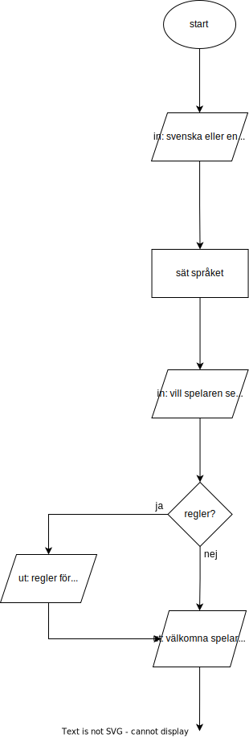
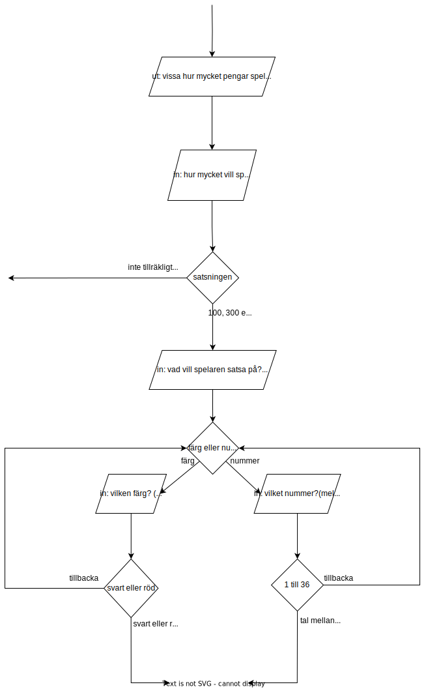

# Inlämningsuppgift 1
# Roulette

 

Grundläggande programmering med C++  
(Erik Gustafsson, Datavetenskap inriktning systemutveckling, a23erigu)

 
 
 
 
 
 

## Introduktion

Uppgiften går ut på att skapa ett roulettehjul.  
Roulettehjulet ska fungera genom att spelaren
startar med 1000 kr som dom ska kunna satsa på 100, 300 eller 500 kr och sedan kunna gissa på antingen nummer eller färg.  
Ojämna nummer är röda och jämna nummer är svarta. Roulettehjulet ska sedan rulla ett nummer mellan 1 och 36. Detta nummer ska sen jämföras med spelarens gissning för att se om spelaren vann.

 

## Problembeskrivning

Några delproblem som har identifierats till detta program är:   
Spelaren ska kunna välja språk i början av programmet.  
Programmet borde kunna visa regler på hur det funkar för spelare som inte spelat roulettehjul förut.  
Hur spelaren ska kunna satsa antingen 100, 300 eller 500 kr.  
Att spelaren inte ska kunna satsa mer pengar en vad den har.  
Hur spelaren ska kunna gissa på antigen nummer eller färg.  
Att om spelaren väljer färg ska den bara kunna gissa på antigen röd eller svart.  
Att om spelaren väljer nummer ska den bara kunna gissa på ett nummer mellan 1 och 36.  
Hur programmet ska rulla ett slumpmässigt nummer mellan 1 och 36.  
Hur programmet ska räkna ut om det slumpmässiga talet är jämt eller inte.  
Hur programmet ska visa vad det är som rullades för spelaren.  
Hur programmet ska jämföra om spelaren har gissar korrekt.  
Att om spelaren gissa korrekt ska programmet ge ut den korrekta mängden pengar som spelaren ska ha vunnit.  
Att om spelaren förlorar ska programmet ta bort pengarna som spelaren satsade.  
Hur spelaren ska få veta hur mycket pengar som den har förlorat/vunnit.  
Hur programmet ska kolla om spelaren fortfarande har pengar.  
Hur spelaren ska få frågan om att fortsätta spela.  

## Antaganden och krav

Några krav som identifierats för detta roulettehjul är:  

### Välja språk mellan svenska och engelska
Språkval är viktigt då det finns många som inte kan svenska och dom borde också kunna köra roulettehjulet.

### Kunna visa regler om spelaren önskar det
Många har inte spelat roulette och olika rouletter har olika regler så borde kunna visa upp reglerna på roulettehjulet.

### Start kapital ska vara 1000kr
Spelaren ska alltid ha 1000kr när dom starta programmet.

### Bara kunna satsa på 100, 300 eller 500kr
Spelaren ska bara kunna välja mellan 100, 300 eller 500 kr om dom har tillräckligt med pengar.

### Bara kunna välja mellan färgerna svart och röd
Svart = jämna tal, Röd = ojämna tal.

### Bara kunna välja nummer mellan 1 och 36
Roulettehjulet ska bara kunna rulla mellan 1 och 36 så spelaren får bara välja mellan dom talen.

### Rulla ett nummer mellan 1 och 36
Det rullade numret ska vara slumpmässigt valt.

### Visa rullningen för spelaren
Spelaren ska alltid kunna se vad programmet rullade för något slumpmässigt nummer.

### Ändra spelarens pengar beroende på om den vann eller förlorade
Om spelaren vann med färg ska den få två gånger satsning.  
Om spelaren vann med nummer ska den få tio gånger satsning.  
Om spelaren förlora ska den förlora det dom satsade.

### Sparka ut spelaren om den har slut på pengar
Spelaren ska inte få spela om den har slut på pengar.

### Kunna fortsätta spela rouletten  
Spelaren ska få fortsätta spela så länge som den har pengar.

 

## Lösningsdesign 

### Start av program

Så som det var tänkt med denna uppgift är det skulle var bäst att 
försöka göra språk delen först då det nog kommer behöva  
skriva ut saker i terminalen till alla andra delar  
så att fixa språket först kändes viktigast.

För att göra språket kändes det som att det skulle vara bäst  
om det i början av programmet deklarerades strängar som sedan kan tilldelas  
beroende på vilket språk folk vill ha.

Efter språk biten borde det vara bäst att fråga om regler så spelaren kan få reglerna på språket som dom föredrar.

Sedan efter reglerna ska programmet skriva ut ett välkomst medelande efter vilket spel loopen borde börja.  

  
bild på språk och regler design i flödesdiagrammet

 
 
 

### Satsning och Gissning

I spel loopen borde det börja med att fråga hur mycket pengar man vill satsa  
då jag tycker man ska satsa pengarna innan valet av vad man satsar på.
Här borde programmet också ha en check för om spelaren har slut på pengar.

Efter att ha tagigt reda på hur mycket pengar spelaren vill satsa så borde programmet ta reda på vad spelaren vill satsa på.

Så som det är tänkt med gissningen är att spelaren ska får börja med att   
bestämma om dom vill gissa på färg eller nummer.  
Om spelaren valde färg får dom sedan gissa mellan röd och svart eller om dom valde nummer får dom välja vilket nummer dom vill gissar på. 

Spelaren ska också ha tillåtelse att gå tillbaka under gissningen om man klickat fel.

 

  
bild på start av loopen, valet av satsningar och valet av gissning

 

### Rullning och vinstcheck

Efter att satsningen och gissningsvalen har hänt ska programmet rulla rouletten.

Rullningen borde börjar med att rulla ett tal mellan 1 och 36 som sedna skrivs ut.  
Efter att ha skrivit ut rullningen ska programmet kolla om spelaren gissade på nummer eller färg.

Om spelaren gissade på nummer så borde programmet bara behöver jämföra vad spelaren gissa på med vad som rullades och om dom är samma så van spelaren.

Om spelaren gissa på färg så ska programmet kolla om det är ett jämt tal eller inte för att ta reda på färg och sedan kolla om spelaren gissa på korrekt färg.

Efter att ha kollat om spelaren vann ska programmet skriva ut resultatet och ändra mängden pengar och totala förändringen.

 

  
bild på rullning och kontroller av resultatet

### Slutet av Programmet

Efter att ha get resultatet så borde spelaren få valet om att köra igen.  
Om spelaren väljer att köra igen så kommer den tillbaka till att få välja satsning.

 

    
bild på hela flödesdiagrammet

 
 
 
 
 
 
 
 
 

## Problem

Problem som stöttes på under programmerandet var

* att få programmet att korrekt skriva ut svenska då output terminalen inte kunde skriva ut å, ä, eller ö korrekt  
Det löstes genom att importera  
<Windows.h>  
vilket innehåller kommandot    
SetConsoleOutputCP(CP_UTF8);  
som satte output terminalen till UTF-8  
så programmet kunde korrekt skriva ut  å, ä och ö.

* att kombinera strängar med ints då det behövdes för att kunna skriva ut vissa delar som hur mycket man hade att spela för.  
Problemet löstes genom att importera  
&lt;string>
som innehöll kommandot   
to_string()   
vilket tillåter konvertering av int till string  
så när det skulle skriva ut hur mycket spelaren hade användes   
money_amount = "Du har " + to_string(current_money) + " kr att spela med";

* att kunna stoppa programmet i några sekunder då programmet skrev ut mycket information samtidigt så det var svårt att hänga med.   
Detta löstes genom att använda kommandot   
_sleep()  
det stoppar programmet i antalet millisekunder som är in skrivet
så genom att skriva in   
_sleep(4000)  
står programmet still i 4 sekunder.
Detta gjorde att det blir enklare för spelaren att hänga med i vad som hände när roulettehjulet kördes.

* att skriva ut dom korrekta variablerna i texten då till en början så skev till exempel  
money_amount = "Du har " + to_string(current_money) + " kr att spela med";  
att spelaren alltid hade 1000 kr även om current_money inte var 1000.  
Problemet låg i att tilldela strängar i början av programmet så mängden pengar sattes alltid till det som current_money var i början vilket var 1000.  
Det löstes genom att tilldela dom specifika strängar senare i spel loopen där variablerna hade ändrats.  
Jag är inte nöjd med denna lösningen då jag skulle föredra att ha alla språk delar i början av programmet men kunde inte hitta någon annan lösning.

* att om man skriver in strängar i en cin som bara tar int så kommer programmet fastna i en oändlig loop.  
Detta är ett problem som jag inte lyckats lösa.  
Har dock hört att det kan finnas ett kommando som checkar efter den typen av bug så man kan skriva ut ett error medelande istället för att programmet fastnar i en oändlig loop.

 
 

## Beskrivning av kod

Början av koden är där variablerna sätts och där så delas dom in i tre bitar strängar som används för text, ints för cin och gömda variabler. 

### Språk

Efter variablerna är språk biten vilket är en cin med en if satts så spelaren väljer ett språk efter vilket programmet använder dom deklarerade variablerna för att sätta språket.

    cin >> language;

        if(language == 1){  // engelska
            invalid_selection = "please try again";
            welcome = "Hello player and welcome to the roulette wheel";
            question_rules = "Do you want to see the rules? (1 for yes 2 for no)";
            rules_1 = "This roulette works in such a way that you can only bet either 100, 300, or 500 kr in one round";
            rules_2 = "you then have to choose whether to bet on numbers or colors (even numbers count as black and uneven numbers count as red)"; 
        }
        else if(language == 2){  // svenska
            invalid_selection = "snälla försök igen";
            welcome = "Hej spelare och välkommen till roulettehjulet";
            question_rules = "Vill du se reglerna? (1 för ja 2 för nej)";
            rules_1 = "Denna roulette fungerar på så sätt att du kan bara satsa antingen 100, 300 eller 500 kr i en omgång";
            rules_2 = "du måste sedan välja om du vill satsa på nummer eller färger (jämna nummer räknas som svarta och ojämna nummer räknas som röda)";
        } 
En del av språk som exempel

 

### Välkomst och Regler

Nästa del i koden är välkomst biten vilket hälsar spelaren välkommen och frågar om regler.

Delen som kommer efter det är början av spel loopen 
loopen börjar med att visa hur mycket pengar spelaren har och totala förändringen av pengar.

 
 
 
 
 
 

### Satsning

Efter vilket hur mycket spelaren vill satsa är.  
Den biten fungera genom att ha en cin som tar 1, 2 eller 3 för att bestämma hur mycket man vill satsa.  
Här var det planerat att kolla om spelaren hade slut på pengar men den biten fick bli flyttad till slutet av spel loopen.

    /*----------------------------*\
    |    tar reda på hur mycket    |
    |    spelaren vill satsa       |
    \*----------------------------*/
    while (true){
        cout<< blank << endl;
        cout<< bet_amount <<endl;

        cin >> ask_bet;

        if (ask_bet == 1) {
            bet = 100;
        }
        else if (ask_bet == 2){
            bet = 300;
        }
        else if (ask_bet == 3){
            bet = 500;
        }
        else{
            cout<< invalid_selection << endl;
            continue;
        }

        // om spelaren inte har tillräckligt för sin valda satsning
        if (bet > current_money){
            cout<< not_enough_money << endl;
            continue;
        }

        break;
    }
Hur koden för satsning av pengar ser ut

 
 
 
 
 
 

### Gissning

Delen som kommer efter är vad spelaren vill satsa på.  
Denna bit börjar som den föra med en cin som är om spelaren vill satsa på antigen nummer eller färg.  
Sedan får spelaren får välja vilket nummer eller färg som dom vill satsa på.   
Spelaren har också valet att gå tillbaka till nummer eller färg gissningen om dom vill ändra sig. 
Genom att använda en variabel för om spelaren vill gissa på nummer eller färg och en för deras gissning så kan jag använda samma variabel till gissningen så choice (variabeln för gissningen) kan vara mellan 1 och 36 om spelaren valde nummer mellan 1 eller 2 om man gissa på färg. 

    /*-------------------------------*\
    |    tar reda på vad för något    |
    |    spelaren vill satsa på      |
    \*-------------------------------*/
    while (true)
    {
        cout<< blank << endl;
        cout<< bet_typ <<endl;

        cin >> ask_chose;

        if (ask_chose == 1){
            cout<< bet_typ_number <<endl;

            cin >> choice;

            if (choice == 0){
                continue;
            } 
            else if (choice < 0 || choice > 36 ){
                cout<< invalid_selection << endl;
                continue;
            }
            break;
        }
        else if (ask_chose == 2){
            cout<< bet_typ_color <<endl;

            cin >> choice;

            if (choice == 0){
                continue;
            } 
            else if (choice < 0 || choice > 2 ){
                cout<< invalid_selection << endl;
                continue;
            }
            break;
        }
        else{
            cout<< invalid_selection << endl;
            continue;
        }
    }
Koden för gissning

 

### Rullning

Efter gissningen så är rullningen av rouletten .  
Rullningen börjar med randomiseringen av ett nummer mellan 1 och 36.  
För att see om svaret är svart eller röd så divideras rullningen med 2 
och sedan kollar om svaret är samma som floor(svaret).  
Detta funkar då floor avrundar tal neråt så om rullningen skulle vara 13 skulle hälften vara 6,5 som floor sedan skulle göra om till 6. Medans om rullningen hade varit jämn hade floor varit samma som hälften av rullningen.  
Alltså för att se om rullningen är jämt så behöver programmet bara kolla om hälften av rullningen är samma som avrundade hälften av rullning.   
Sedan används true_role för att göra rullningen till int då doubles är svåra att få till exakta heltal när dom ska skrivas ut.

    /*----------------------------*\
    |    hur rullandet går till    |
    \*----------------------------*/
    role = rand() % 36 + 1;

    role_check = role/2;

    if (role_check == floor(role_check)){
        if(language == 2){
            color_text = "svart";
            color_number = 1;
        }
        else{
            color_text = "black";
            color_number = 1;
        }
    }
    else{
        if(language == 2){
            color_text = "röd";
            color_number = 2;
        }
        else{
            color_text = "red";
            color_number = 2;
        }
        
    }

    true_role = floor(role);
Koden för rullning

 

### Vinst check

Näst sista biten av koden är för att kolla om spelaren van.  
Denna biten är flera nästan identiska if satser som kollar om spelaren gissa korrekt.

    else if (ask_chose == 2 && choice == 2 && color_number == 1){ //om spelaren gissa korrekt på färgen svart
        money_change = bet * 2;
        current_money += money_change;
        total_win += money_change;
        if (language == 2){
            win_color = "Du satsade på rätt färg och har vunnit "+ to_string(money_change) + "kr";       
        }
        else{
            win_color = "You betted on the correct color and have won "+ to_string(money_change) + "kr";
        }
        cout<< blank << endl;
        cout<< win_color << endl;
        _sleep(3000);
    }
Exempel på hur en av vinst checkarna ser ut

 

### Fortsätt spela

Sista biten av programmet är om spelaren vill köra igen och en check om spelaren fortfarande har pengar.
Anledningen checken om spelaren har pengar flyttades hit är för att annars skulle spelaren få valet om att fortsätta spela även om dom inte har några pengar.

 
 
 
 
 

## Diskussion

Några svagheter med hur jag har tänkt mig programmet ska fungera är att spelaren skulle behöva starta om om dom vill kunna byta språk eller undrar något om reglerna. Ett annat problem skulle vara att spelaren inte kan gå tillbaka om dom vill ändra hur mycket pengar dom vill satsa.

En styrka med mitt sätt är att spelaren måste välja att satsa på antigen färg eller nummer först vilket betyder att om spelaren vill rösta på nummer så behöver programmet bara jämföra nummer och inte bry sig om vilken färg det blev. En annan styrka med mit program är att det är ganska spelar vänligt då spelaren får själv välja vilket språk dom vill använda och att jag använder sleep så spelaren får ut informationen på ett långsammare sät så dom hinner med. Något som jag tycker är en styrka är att jag har nästa all mina strängar i början av koden så skulle jag behöva ändra något med språket behöver jag bara ändra i början av programmet för att ändra outputen. 

 

## Källkod

    #include <iostream> 
    #include <string>       //används för att kunna konvertera int till string
    #include <ctime>        //används för att kunna slumpa fram ett tal
    #include <Windows.h>    //används för att kunna sätta output konsollen till UTF-8
    using namespace std;

    int main()
    {
        SetConsoleOutputCP(CP_UTF8);
        srand(time(0));

        // gömda variabler
        int total_win = 0;
        int current_money = 1000;
        int money_change = 0;
        int bet = 0;
        int bet_chose = 0;
        int choice = 0;
        double role = 0;
        double role_check = 0;
        int true_role = 0;
        string color_text;
        int color_number;
        int keep_going = 0;

        // variabler för cin
        int language;
        int ask_rules;
        int ask_bet;
        int ask_chose;

        // variabler som används för språket
        string blank = " ";
        string invalid_selection;
        string welcome;
        string question_rules;
        string rules_1;
        string rules_2;
        string rules_3;
        string rules_4;
        string rules_5;
        string money_amount;
        string total_change;
        string no_more_money;
        string not_enough_money;
        string bet_amount;
        string bet_typ;
        string bet_typ_nummber;
        string bet_typ_color;
        string the_role;
        string win_nummber;
        string win_color;
        string lose;
        string keep_playing;

        /*--------------------------------------------*\
        |    tar reda på vilket språk spelaren vill    |
        |    använda och sätter språket till det       |
        \*--------------------------------------------*/
        while (true)
        {
            cout<< "please select a language" << endl;    
            cout<< "1 for english 2 för svenska" << endl; 
            
            cin >> language;

            if(language == 1){  // engelska
                invalid_selection = "please try again";
                welcome = "Hello player and welcome to the roulette wheel";
                question_rules = "Do you want to see the rules? (1 for yes 2 for no)";
                rules_1 = "This roulette works in such a way that you can only bet either 100, 300, or 500 kr in one round";
                rules_2 = "you then have to choose whether to bet on numbers or colors (even numbers count as black and uneven numbers count as red)";
                rules_3 = "the roulette will then roll a random number between 1 and 36 and compare it to your bet";
                rules_4 = "if you betted correctly you get the reward (10 times bet if betting on numbers and 2 times bet if betting on color)";
                rules_5 = "and if you betted wrong you lose what you betted.";
                money_amount = "You currently have " + to_string(current_money) + " kr to play with";
                total_change = "Your current total change in money is " + to_string(total_win);
                no_more_money = "You have lost all of your money and have therefore been kicked out of the roulette";
                not_enough_money = "You don't have enough money for that bet";
                bet_amount = "bet either 100, 300 or 500 kr (1 for 100, 2 for 300, 3 for 500)";
                bet_typ = "number or color (1 for number 2 for color)";
                bet_typ_nummber = "bet on a number between 1 and 36 (0 to go back)";
                bet_typ_color = "bet on red or black (0 to go back, 1 for red, 2 for black)";
                the_role = "The roulette has rolled the number " + to_string(true_role) + " which is the color " + color_text;
                win_nummber = "You betted on the correct number and have won " + to_string(money_change) + "kr";
                win_color = "You betted on the correct color and have won "+ to_string(money_change) + "kr";
                lose = "You betted wrong and have lost " + to_string(money_change) + "kr";
                keep_playing = "Do you want to keep playing? (1 for yes 2 for no)";
            }
            else if(language == 2){  // svenska
                invalid_selection = "snälla försök igen";
                welcome = "Hej spelare och välkommen till roulettehjulet";
                question_rules = "Vill du se reglerna? (1 för ja 2 för nej)";
                rules_1 = "Denna roulette fungerar på så sätt att du kan bara satsa antingen 100, 300 eller 500 kr i en omgång";
                rules_2 = "du måste sedan välja om du vill satsa på nummer eller färger (jämna nummer räknas som svarta och ojämna nummer räknas som röda)";
                rules_3 = "rouletten kommer sedan att rulla ett slumpmässigt nummer mellan 1 och 36 och jämföra det med din insats";
                rules_4 = "om du satsade rätt får du belöningen (10 gånger satsning om du satsar på siffror och 2 gånger satsning om du satsar på färg)";
                rules_5 = "och om du satsade fel förlorar du det du satsade.";
                money_amount = "Du har " + to_string(current_money) + " kr att spela med";
                total_change = "Din nuvarande totala förändring i pengar är " + to_string(total_win);
                no_more_money = "Du har förlorat alla dina pengar och har därför blivit utslängd från rouletten";
                not_enough_money = "Du har inte tillräckligt med pengar för den satsningen";
                bet_amount = "satsa antingen 100, 300 eller 500 kr (1 för 100, 2 för 300, 3 för 500)";
                bet_typ = "nummer eller färg (1 för nummer 2 för färg)";
                bet_typ_nummber = "satsa på ett nummer mellan 1 och 36 (0 för att gå tillbaka)";
                bet_typ_color = "satsa på rött eller svart (0 för att gå tillbaka, 1 för rött, 2 för svart)";
                the_role = "Rouletten har rullat numret " + to_string(true_role) + " vilken är färgen " + color_text;
                win_nummber = "Du satsade på rätt nummer och har vunnit " + to_string(money_change) + "kr";
                win_color = "Du satsade på rätt färg och har vunnit "+ to_string(money_change) + "kr";
                lose = "Du satsade fel och har förlorat " + to_string(money_change) + "kr";
                keep_playing = "Vill du fortsätta spela? (1 för ja 2 för nej)";
            } 
            else{
                cout<< invalid_selection << endl;
                continue;
            }

            break;
        }

        /*-----------------------------------*\
        |    välkomnar spelaren och visar     |
        |    regler om dom vill se dom        |
        \*-----------------------------------*/
        while (true){
            cout<< blank << endl;
            cout<< welcome << endl;
            cout<< question_rules << endl;

            cin >> ask_rules;

            if (ask_rules == 1){
                cout<< blank << endl;
                cout<< rules_1 << endl;
                cout<< rules_2 << endl;
                cout<< rules_3 << endl;
                cout<< rules_4 << endl;
                cout<< rules_5 << endl;
                _sleep(5000);
                break;
            }
            else if(ask_rules == 2){
                break;
            }
            else{
                cout<< invalid_selection << endl;
            }

        }

        /*--------------------------*\
        |    startar spel loppen     |
        \*--------------------------*/
        while (true){
            if (language == 2){
                money_amount = "Du har " + to_string(current_money) + " kr att spela med";
                total_change = "Din nuvarande totala förändring i pengar är " + to_string(total_win);
            }
            else{
                money_amount = "You currently have " + to_string(current_money) + " kr to play with";
                total_change = "Your current total change in money is " + to_string(total_win);
            }
            cout<< blank << endl;
            cout<< money_amount <<endl;
            cout<< total_change <<endl;

            /*----------------------------*\
            |    tar reda på hur mycket    |
            |    spelaren vill satsa       |
            \*----------------------------*/
            while (true){
                cout<< blank << endl;
                cout<< bet_amount <<endl;

                cin >> ask_bet;

                if (ask_bet == 1) {
                    bet = 100;
                }
                else if (ask_bet == 2){
                    bet = 300;
                }
                else if (ask_bet == 3){
                    bet = 500;
                }
                else{
                    cout<< invalid_selection << endl;
                    continue;
                }

                // om spelaren inte har tillräckligt för sin valda satsning
                if (bet > current_money){
                    cout<< not_enough_money << endl;
                    continue;
                }

                break;
            }

            /*-------------------------------*\
            |    tar reda på vad för något    |
            |    spelaren vill satsa på       |
            \*-------------------------------*/
            while (true)
            {
                cout<< blank << endl;
                cout<< bet_typ <<endl;

                cin >> ask_chose;

                if (ask_chose == 1){
                    cout<< bet_typ_nummber <<endl;

                    cin >> choice;

                    if (choice == 0){
                        continue;
                    } 
                    else if (choice < 0 || choice > 36 ){
                        cout<< invalid_selection << endl;
                        continue;
                    }
                    break;
                }
                else if (ask_chose == 2){
                    cout<< bet_typ_color <<endl;

                    cin >> choice;

                    if (choice == 0){
                        continue;
                    } 
                    else if (choice < 0 || choice > 2 ){
                        cout<< invalid_selection << endl;
                        continue;
                    }
                    break;
                }
                else{
                    cout<< invalid_selection << endl;
                    continue;
                }
            }

            /*----------------------------*\
            |    hur rullandet går till     |
            \*----------------------------*/
            role = rand() % 36 + 1;

            role_check = role/2;

            if (role_check == floor(role_check)){
                if(language == 2){
                    color_text = "svart";
                    color_number = 1;
                }
                else{
                    color_text = "black";
                    color_number = 1;
                }
            }
            else{
                if(language == 2){
                    color_text = "röd";
                    color_number = 2;
                }
                else{
                    color_text = "red";
                    color_number = 2;
                }
                
            }

            true_role = floor(role);

            if (language == 2){
                the_role = "Rouletten har rullat numret " + to_string(true_role) + " vilken är färgen " + color_text;
            }
            else{
                the_role = "The roulette has rolled the number " + to_string(true_role) + " which is the color " + color_text;
            }

            _sleep(1000);
            cout<< blank << endl;
            cout<< the_role << endl;
            _sleep(3000);

            /*----------------------------------*\
            |    tar reda på om spelaren van     |
            \*----------------------------------*/
            if (ask_chose == 1 && choice == role){  //om spelaren gissa på korrekt nummer
                money_change = bet * 10;
                current_money += money_change;
                total_win += money_change;
                if (language == 2){
                    win_nummber = "Du satsade på rätt nummer och har vunnit " + to_string(money_change) + "kr";
                }
                else{
                    win_nummber = "You betted on the correct number and have won " + to_string(money_change) + "kr";
                }
                cout<< blank << endl;
                cout<< win_nummber << endl;
                _sleep(3000);
            }
            else if (ask_chose == 2 && choice == 2 && color_number == 1){ //om spelaren gissa korrekt på färgen svart
                money_change = bet * 2;
                current_money += money_change;
                total_win += money_change;
                if (language == 2){
                    win_color = "Du satsade på rätt färg och har vunnit "+ to_string(money_change) + "kr";       
                }
                else{
                    win_color = "You betted on the correct color and have won "+ to_string(money_change) + "kr";
                }
                cout<< blank << endl;
                cout<< win_color << endl;
                _sleep(3000);
            }
            else if (ask_chose == 2 && choice == 1 && color_number == 2){ //om spelaren gissa korrekt på färgen röd
                money_change = bet * 2;
                current_money += money_change;
                total_win += money_change;
                if (language == 2){
                    win_color = "Du satsade på rätt färg och har vunnit "+ to_string(money_change) + "kr";
                }
                else{
                    win_color = "You betted on the correct color and have won "+ to_string(money_change) + "kr";
                }
                cout<< blank << endl;
                cout<< win_color << endl;
                _sleep(3000);
            }
            else{                                                   // om spelaren satsade fel
                money_change = bet;
                current_money -= money_change;
                total_win -= money_change;
                if (language == 2){
                    lose = "Du satsade fel och har förlorat " + to_string(money_change) + "kr";
                }
                else{
                    lose = "You betted wrong and have lost " + to_string(money_change) + "kr";
                }
                cout<< blank << endl;
                cout<< lose << endl;
                _sleep(3000);
            }

            if (language == 2){
                money_amount = "Du har " + to_string(current_money) + " kr att spela med";
                total_change = "Din nuvarande totala förändring i pengar är " + to_string(total_win);
            }
            else{
                money_amount = "You currently have " + to_string(current_money) + " kr to play with";
                total_change = "Your current total change in money is " + to_string(total_win);
            }
            cout<< blank << endl;
            cout<< money_amount <<endl;
            cout<< total_change <<endl;
            _sleep(3000);

            /*-----------------------------*\
            |     check om spelaren         |
            |     fortfarande har pengar    |
            \*-----------------------------*/
            if (current_money <= 0){
                cout<< blank << endl;
                cout<< no_more_money <<endl;
                break;
            }

            /*-------------------------------*\
            |    vill spelaren fortsätta?     |
            \*-------------------------------*/
            while (true)
            {
                cout<< blank << endl;
                cout<< keep_playing << endl;
                cin >> keep_going;

                if(keep_going == 1 || keep_going == 2){
                    break;
                }
    
                cout<< invalid_selection << endl;
                continue;
            }
            
            if (keep_going == 2){
                break;
            }
    
        }
        
        
        return 0;
    }

